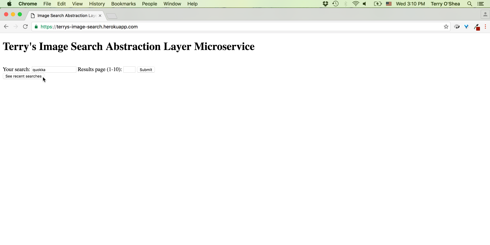

https://terrys-image-search.herokuapp.com/

A microservice kind of like (and reliant upon) Google Image Search--you can search for a term and a results page and get back 
the URLs of 10 relevant images along with snippets of info about them, thumbnail URLs, and the context (another URL, the news
article from which a picture was taken e.g.). You can also see what the 10 most recent searches were. 

For example: 

'https://terrys-image-search.herokuapp.com/new_search?search=water+buffalo&page=1'
outputs
[{"url":"https://sites.google.com/a/wornickjds.org/endangered-animals-class-of-2019/_/rsrc/1467035359217/home/wild-water-buffalo/
Jonah-wild%20water%20buffalo.jpg","snippet":"Wild Water Buffalo","thumbnail":"https://encrypted-tbn0.gstatic.com/images?
q=tbn:ANd9GcR5O0g_KEwpfMFvFtYyIdlYA1tmgx3Tqx5wHENAW-DnqoRKcXJkQ4tIbbM","context":"https://sites.google.com/a/wornickjds.org/
endangered-animals-class-of-2019/home/wild-water-buffalo"},{...}...]

